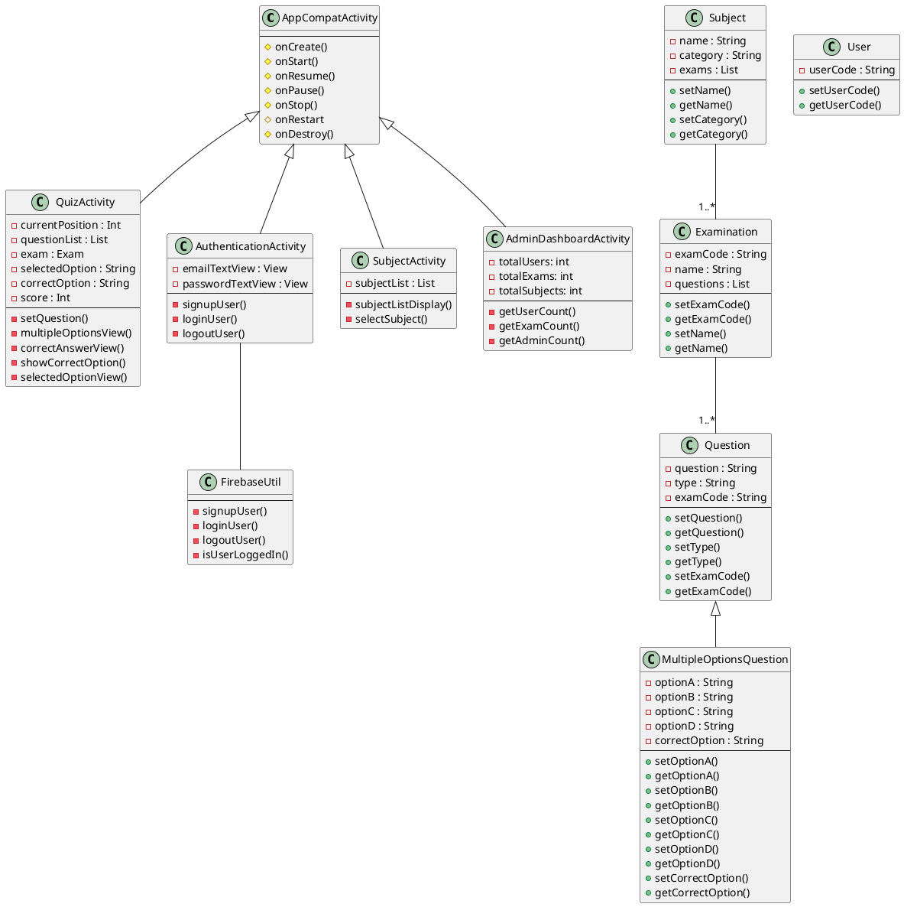

```plantuml
@startuml
class "AppCompatActivity" as compact {
  --
  # onCreate()
  # onStart()
  # onResume()
  # onPause()
  # onStop()
  # onRestart
  # onDestroy()
}

class "QuizActivity" as quiz {
  - currentPosition : Int
  - questionList : List
  - exam : Exam
  - selectedOption : String
  - correctOption : String
  - score : Int
  --
  - setQuestion()
  - multipleOptionsView()
  - correctAnswerView()
  - showCorrectOption()
  - selectedOptionView()
}

class "Question" as question {
  - question : String
  - type : String
  - examCode : String
  --
  + setQuestion()
  + getQuestion()
  + setType()
  + getType()
  + setExamCode()
  + getExamCode()
}

class "MultipleOptionsQuestion" as mOptions {
  - optionA : String
  - optionB : String
  - optionC : String
  - optionD : String
  - correctOption : String
  --
  + setOptionA()
  + getOptionA()
  + setOptionB()
  + getOptionB()
  + setOptionC()
  + getOptionC()
  + setOptionD()
  + getOptionD()
  + setCorrectOption()
  + getCorrectOption()
}

class "FirebaseUtil" as firebase {
  --
  - signupUser()
  - loginUser()
  - logoutUser()
  - isUserLoggedIn()
}

class "Subject" as subject {
  - name : String
  - category : String
  - exams : List
  --
  + setName()
  + getName()
  + setCategory()
  + getCategory()
}

class "Examination" as exam {
  - examCode : String
  - name : String
  - questions : List
  --
  + setExamCode()
  + getExamCode()
  + setName()
  + getName()
}

class "AuthenticationActivity" as authentication {
  - emailTextView : View
  - passwordTextView : View
  --
  - signupUser()
  - loginUser()
  - logoutUser()
}

class "SubjectActivity" as subjectActivity {
  - subjectList : List
  --
  - subjectListDisplay()
  - selectSubject()
}

class "User" as user {
  - userCode : String
  --
  + setUserCode()
  + getUserCode()
}

class "AdminDashboardActivity" as dash {
  - totalUsers: int
  - totalExams: int
  - totalSubjects: int
  --
  - getUserCount()
  - getExamCount()
  - getAdminCount()
}

question <|-- mOptions
compact <|-- quiz
compact <|-- authentication
compact <|-- subjectActivity
compact <|-- dash
authentication -- firebase
subject -- "1..*" exam
exam -- "1..*" question
@enduml

```