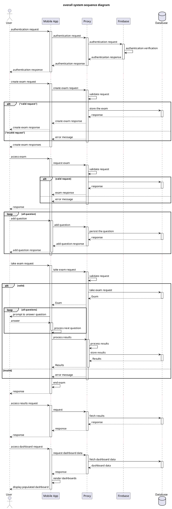

```plantuml
@startuml
title overall system sequence diagram

actor "User" as user
participant "Mobile App" as funzo
participant Proxy as proxy
participant Firebase as fire
database "Database" as db

'authenticate'
user -> funzo: authentication request
activate funzo
  funzo -> proxy: authentication request
  activate proxy
    proxy -> fire: authentication request
    activate fire
      fire -> fire: authenticaiton verification
      fire --> proxy: authenticaiton response
    deactivate fire
    proxy --> funzo: authenticaiton response
  deactivate proxy
  funzo --> user: authenticaiton response
deactivate funzo

...
'add exam'
user -> funzo: create exam request
activate funzo
  funzo -> proxy: create exam request
  activate proxy
    proxy -> proxy: validate request
    alt "valid request"
      proxy -> db: store the exam 
      activate db
        db --> proxy: response
      deactivate db
      proxy --> funzo:  create exam response
      funzo --> user: create exam response
    else "invalid request"
      proxy --> funzo: error message
    end alt
  deactivate proxy
  funzo --> user: create exam responses 
deactivate funzo

...
'add questions'
user -> funzo: access exam
activate funzo
  funzo -> proxy : request exam
  activate proxy
    proxy -> proxy: validate request
    alt valid request
    
      proxy -> db: 
      activate db
        db --> proxy: response
      deactivate db
      proxy --> funzo : exam response
    else
      proxy --> funzo: error message
    end alt
  deactivate proxy
  funzo --> user:  response 
  loop all question
    user -> funzo: add question
    activate funzo
      funzo -> proxy: add question
      activate proxy
        proxy -> db: persist the question
      activate db
        db --> proxy: response
      deactivate db
      proxy --> funzo: add question response
      deactivate proxy
    funzo --> user: add question response
    deactivate funzo
  end loop
deactivate funzo
...
'take the exam'

user -> funzo: take exam request
activate funzo
  funzo -> proxy: take exam request
  activate proxy
    proxy -> proxy: validate request
    alt valid
      proxy -> db: take exam request
      activate db
        db --> proxy: Exam
      deactivate db
      proxy --> funzo: Exam
        loop all questions
          funzo -> user: prompt to answer question
          user --> funzo: answer
          activate funzo
            funzo -> funzo: process next question
          deactivate funzo
        end loop 
        funzo -> proxy: process results
        activate proxy
          proxy -> proxy: process results
          proxy -> db: store results
          activate db
            db --> proxy: Results
          deactivate db
          proxy --> funzo: Results
        deactivate proxy
    else invalid
      proxy --> funzo: error message
    end alt
  deactivate proxy
  funzo -> funzo: end exam
  funzo --> user: response
deactivate funzo
...

'access results'

user -> funzo: access results request
activate funzo
  funzo -> proxy: request
  activate proxy
      proxy -> db: fetch results
      activate db
        db --> proxy: response
      deactivate db
      proxy --> funzo: response
  deactivate proxy

  funzo --> user: response
deactivate funzo
...
'access dashboards'

user -> funzo: access dashboard request
activate funzo
  funzo -> proxy: request dashboard data
  activate proxy
      proxy -> db: fetch dashboard data
      activate db
        db --> proxy: dashboard data
      deactivate db
      proxy --> funzo: response
  deactivate proxy
  funzo -> funzo: render dashboards
  funzo --> user: display populated dashboard
deactivate funzo
@enduml

```